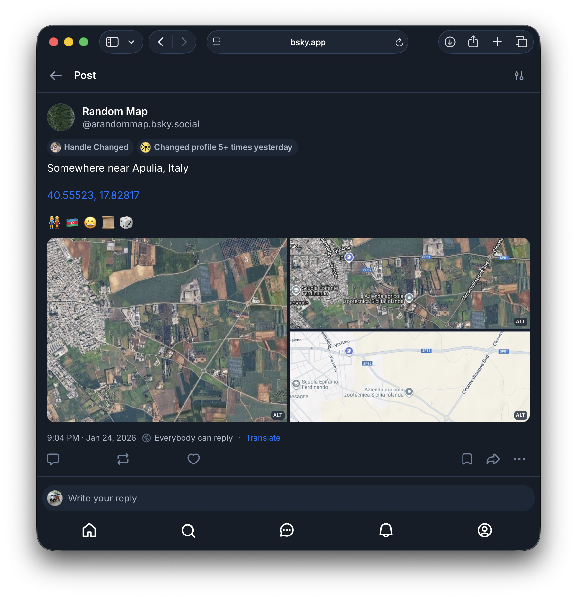

# RandomMap
<p align="center">
    <a href = "https://bsky.app/profile/arandommap.bsky.social">
        
    </a>
</p>

[@arandommap.bsky.social](https://bsky.app/profile/arandommap.bsky.social) is a Bluesky bot that runs every hour on a Raspberry Pi and posts random aerial images of the Earth. Inspired by the [Earth View extension for Google Chrome](https://chrome.google.com/webstore/detail/earth-view-from-google-ea/bhloflhklmhfpedakmangadcdofhnnoh?hl=en). I had a five hour layover and decided to be productive.

# Code
RandomMap picks a random continent (including Antarctica) and generates random coordinates inside the chosen continent. It uses the Google Maps API to download satellite, hybrid, and terrain images of the generated coordinates, performs reverse geocoding to get location names, and posts the pictures to Bluesky!

The bot also maintains a journey map showing the last 8 locations visited, displayed as a banner on the profile with numbered, color-coded pins.

# Run
Run `npm ci` to download project dependencies

Create a `keys.js` file and create objects to hold your Bluesky and Google Developer API keys. Make sure to export them, too:
```js
const google = {
  key: '...',
};

const bluesky = {
  identifier: '....',
  password: '...',
  service: 'https://bsky.social',
};

module.exports = {
  google,
  bluesky
};
```

## Initial Setup
If the bot has already been running and you want to populate the journey map with past locations, run:
```bash
node populate_history.js
```

This will fetch your last 8 posts and create the `location_history.json` file.

## Running the Bot
Now you're all set. Simply do `npm run local`